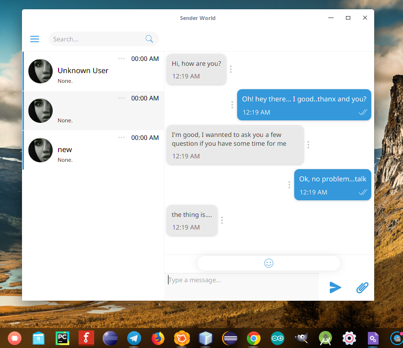
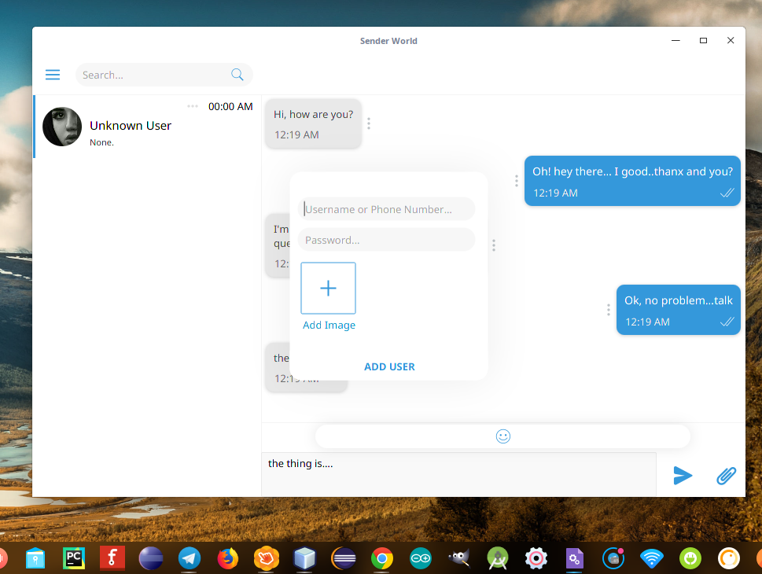
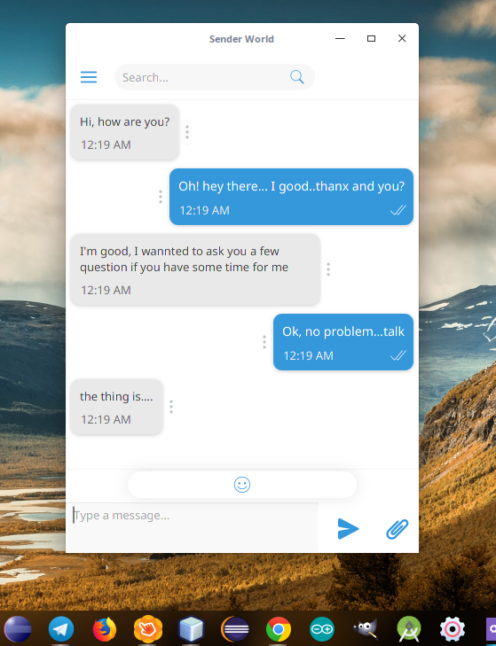

# JavaFX-Chat-App-UI-UX-Design
This is basically a simple UI/UX design built usign java and FX framework
to controll and handle data from API or direct Database.
 
 
<a href="https://openjfx.io/">JavaFX IO</a>
 
## Libraries considered to be used in this app
1- JFonix <a href="http://www.jfoenix.com/"> SEE MORE </a> (Optional Use)
 
 
## Here are some Screenshots below:

 
Main UI after success login.
 
 

 
Adding new contact [User] UI.
 
 

 
The UI or Frame can be fully resized with customized properties with its components.
 
 

## Enjoy.
## OK!

